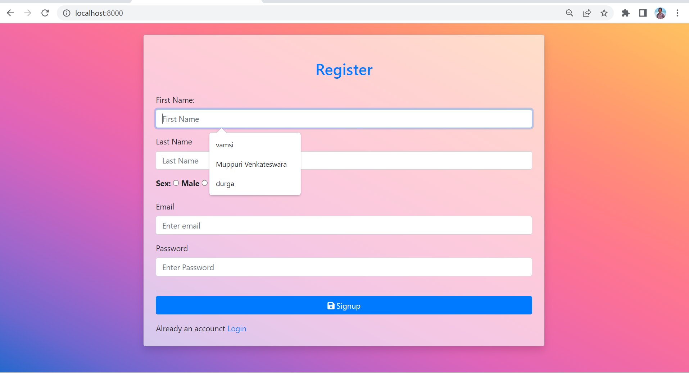

# django-mysql.github.io
This is a basic login and register System which is Implemented by mySql database.
To run this, 
->Activate Virtual Environment ("venv\Scripts\activate") 
->create a table("tab") in mySql database("loginsys") 
->now, Connect using " pip install mysql-connector-python " it will connect to our database 
->run "python manage.py makemigrations" 
->run "python manage.py migrate" 
->run "python manage.py runserver" 
now, it will give like this (Starting development server at http://127.0.0.1:8000/) 
open that link.  
It will ask for register 

  
Before Entering details, The database is: 

  
After Registering, Check Your database, It will be like this.. 
 
The above picture tells that the data which we are given in registration form is inserted into this table. 
 
Now login With your Credientils, 
 
 
If you enter the correct Details in login, You will be Redirected to welcome page, 
  
Otherwise, You will get a popup notification and resirected to Error page,: 

For any Queries, you can contact me on Linkedin:
&nbsp;<a href="https://www.linkedin.com/in/muppuri-venkateswara-vamsi-kumar-2a6167208/"><button value="contact Me">Contact Me</button></a>
